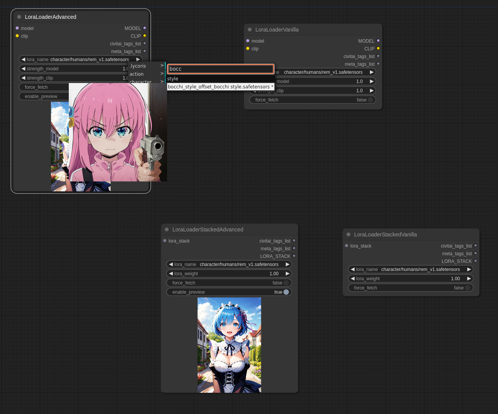
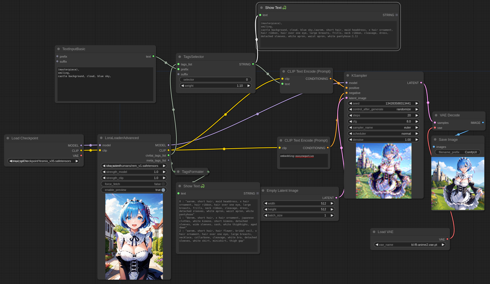
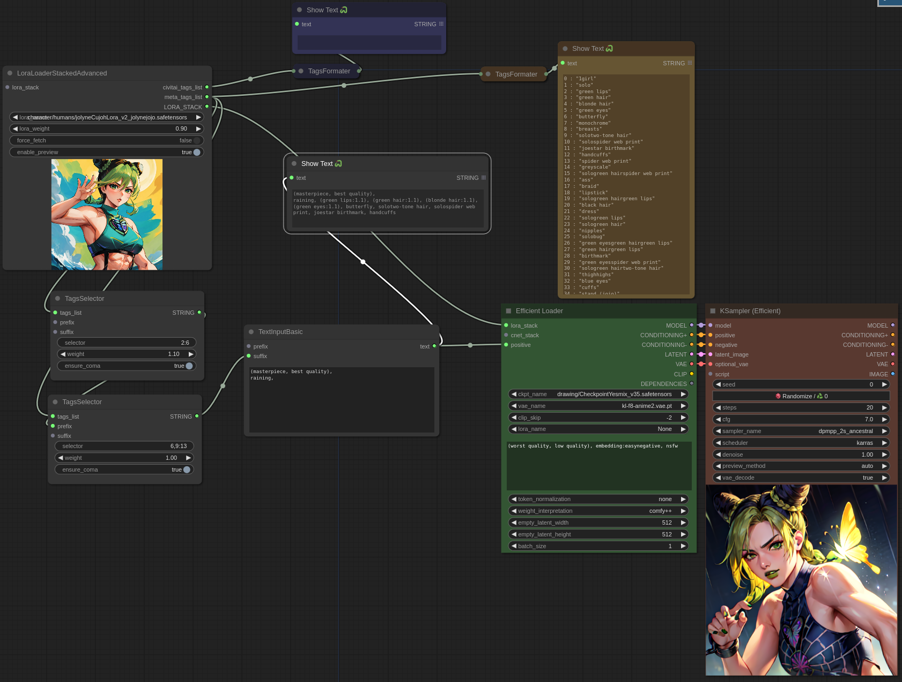
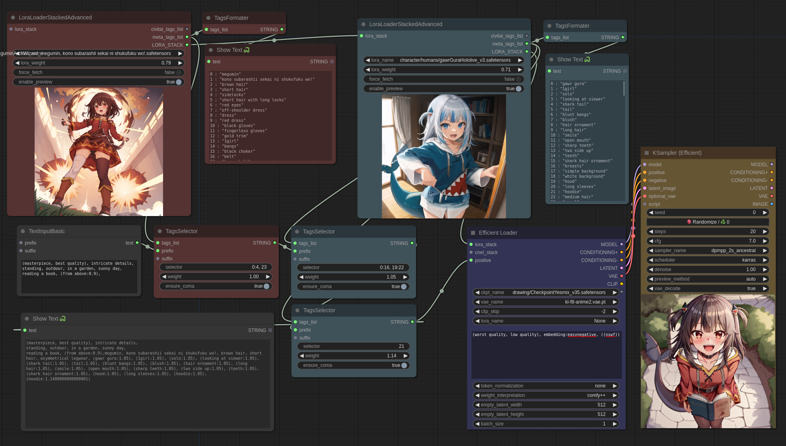

# ComfyUI-Lora-Auto-Trigger-Words

This project is a fork of https://github.com/Extraltodeus/LoadLoraWithTags
The aim of these custom nodes is to get an _easy_ access to the tags used to trigger a lora. 
This project is compatible with Stacked Loras from https://github.com/LucianoCirino/efficiency-nodes-comfyui/releases
I talk about **lora**, but works with **lycoris** too.

## Install
Some of this project nodes depends on https://github.com/pythongosssss/ComfyUI-Custom-Scripts :
- LoraLoaderAdvanced
- LoraLoaderStackedAdvanced
They get their vanilla equivalents. 

Overall, Custom-Scripts is recommended to be able to know the content of the tag lists with the node `showText`

## Features
### Main nodes
#### Vanilla vs Advanced
Vanilla refers to nodes that have no lora preview from the menu, nor the lora list. But the features provided are the same.

#### Nodes
- LoraLoader (Vanilla or Advanced)
- LoraLoaderStacked (Vanilla or Avanced). The stacked lora input is optional.
Allow to load a lora, either the normal way, or the efficiency-nodes way.
These loaders have two custom outputs:
- civitai_tags_list: a python list of the tags related to this lora on civitai
- meta_tags_list: a python list of the tags used for training the lora embeded in it (if any)
This outputs needs to be filtered by two othere nodes:
- TagsFormater: Helper to show the available tag and their indexes
- tagsSelector: allow to filter tags and apply a weight to it.
    - TagSelector contains four parameters. First the selector (see Filtering next)
    - The weight `(tag:weight)`
    - The boolean `ensure_comma`. To properly append comma if a prefix or suffix is added.
    - The boolean `append_loraname_if_empty` which will add the name of the lora in the list of outputs if they are empty.
#### Filtering
The format is simple. It's the same as python list index, but can select multiple index or ranges of indexes separated by comas.
`Ex: 0, 3, 5:8, -8:`
- Select a specific list of indexes: `0, 2, 3, 15`...
- Select range of indexes: `2:5, 10:15`...
- Select a range from the begining to a specific index: `:5`
- Select a range from a specific index to the end: `5:`
- You can use negative indexes. Like `-1` to select the last tag
- By default `:` selects everything

#### Example of normal workflow

#### Example of Stacked workflow

#### Chaining Selectors and Stacked
Tags selectors can be chained to select differents tags with differents weights `(tags1:0.8), tag2, (tag3:1.1)`.
Lora Stack can also be chained together to load multiple loras into an efficient loaders.

### Side nodes I made and kept here
- FusionText: takes two text input and join them together
- Randomizer: takes two couples text+lorastack and return randomly one them
- TextInputBasic: just a text input with two additional input for text chaining
